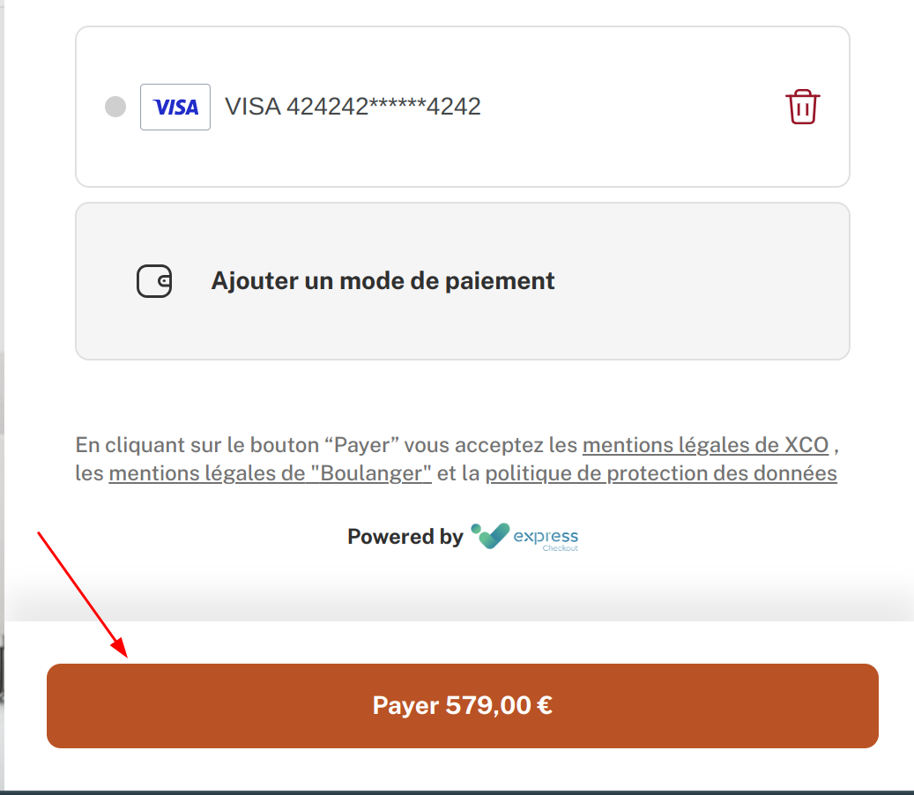

## Description

You can easily customize the widget's style and properties via the dashboard.

## The widget configuration page

After you sign in to your dashboard, you will have access to the widget configuration page.
If you have the admin access rights on the entity, you will be able to edit the widget's configuration.

Here is how it looks like:

Let's take a look at what parameters you can edit:

### The merchant name

The merchant name is displayed at the bottom of the widget's GCU text.

### The logo URL

The URL of the logo that is displayed when the widget is loading.

### The GCU URL

The URL of the General Conditions of Use (`GCU`).

### Primary color of the button

You can customize the color of the checkout button.

### Hover color of the button

You can also customize the hover color of the checkout button.

### The Credit card brand selection

You can choose the credit card brand when you enter a new credit card.

#### Hypertext

you can choose the token brand from a hypertext dropdown.

#### Select

You can select the token type from a dropdown.

#### In Pan Input

The brands are displayed inside the input field.

#### Hidden

The brands selection is hidden.

### Display the CVV field

You can choose either or not to display the CVV field for a saved credit card.
Here is an example of the CVV display modes:

#### ON (show the CVV field)

#### OFF (hide the CVV field)

